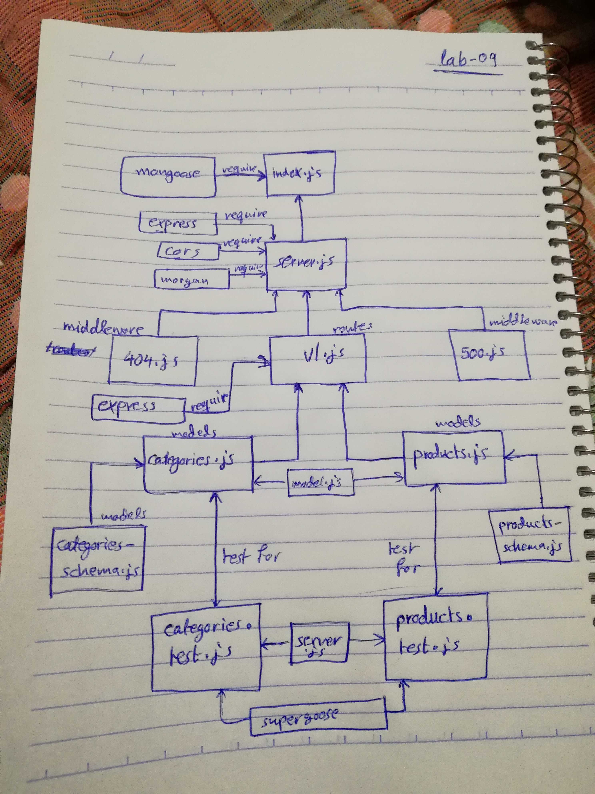

# LAB - Class 09

## Dynamic Api Server

### Author: Ahmad K. Al-Mahasneh 

### Links and Resources

- [submission PR](https://github.com/401-advanced-javascript-AhmadK/dynamic-api-server/pull/1)
- [ci/cd](https://github.com/401-advanced-javascript-AhmadK/dynamic-api-server/actions) (GitHub Actions)

### Setup

#### `.env` requirements (where applicable)

- `PORT` - 3000
- `MONGODB_URI` - mongodb://localhost:27017/lab09db

#### How to initialize/run your application (where applicable)

- `npm run start`

#### Tests

- How do you run tests?
   npm run test
- Any tests of note?
  jest --verbose --coverage supergoose 
- Describe any tests that you did not complete, skipped, etc

#### UML

